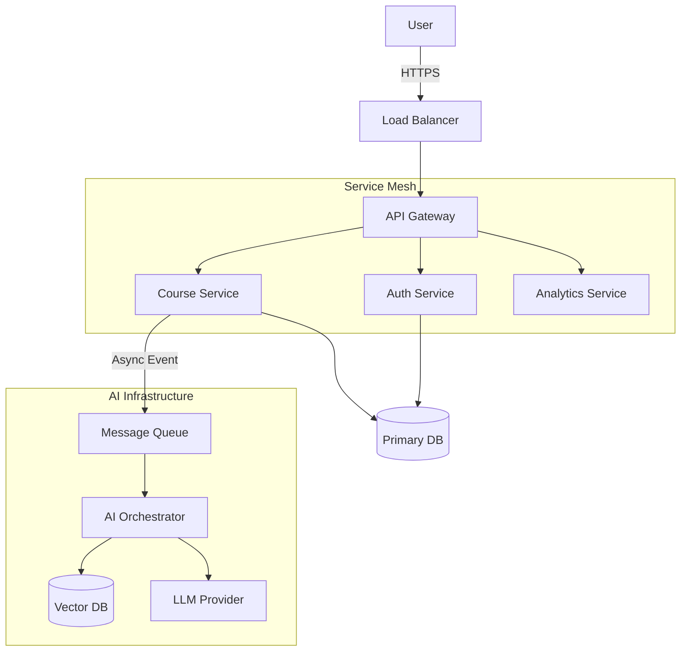

# AI Education Platform

[](https://opensource.org/licenses/MIT)
[]()

**A scalable, microservices-based Learning Management System illustrating the integration of Large Language Models (LLMs) into educational workflows.**

## Overview

The AI Education Platform is designed to demonstrate a modern approach to EdTech, moving beyond static content delivery to dynamic, AI-assistive learning. It addresses the challenge of personalized education at scale by leveraging Retrieval-Augmented Generation (RAG) to provide context-aware tutoring and assessment generation.

This repository contains the complete source code for the platform, including the React frontend, Node.js backend services, Python AI orchestrators, and infrastructure configuration.

[Architecture](#architecture) • [System Design](#system-design) • [AI Pipeline](#ai-pipeline) • [local Development](#local-development)

---

## Key Technical Features

- **Retrieval-Augmented Generation (RAG)**: Implements a vector-search pipeline using Qdrant/Pinecone to ground LLM responses in verifiable course content, minimizing hallucination.
- **Microservices Architecture**: Decoupled services for Authentication, Content Management, and AI Orchestration, allowing for independent scaling and deployment.
- **Event-Driven Processing**: Utilizes message queues (Kafka/RabbitMQ) for handling high-latency AI tasks (e.g., PDF ingestion, embedding generation) asynchronously.
- **Adaptive Assessment Engine**: Dynamically generates quizzes and exams based on student performance data and content coverage gaps.
- **Role-Based Access Control (RBAC)**: Secure, granular permission systems implemented at the API Gateway and Service levels.

---

## Technology Stack

The stack was selected to optimize for type safety, concurrency, and AI ecosystem integration.

| Layer                | Technology                  | Rationale                                                       |
| :------------------- | :-------------------------- | :-------------------------------------------------------------- |
| **Frontend**         | React, TypeScript, Tailwind | Component modularity and compile-time type safety.              |
| **API Gateway**      | Kong / NGINX                | Centralized authentication, rate limiting, and request routing. |
| **Backend Services** | Node.js (Express/NestJS)    | High-throughput I/O handling for RESTful APIs.                  |
| **AI Orchestration** | Python (FastAPI, LangChain) | Native support for PyTorch/TensorFlow and LLM drivers.          |
| **Data Persistence** | PostgreSQL                  | ACID compliance for transactional user and course data.         |
| **Caching & State**  | Redis                       | Ephemeral storage for session management and API caching.       |
| **Vector Search**    | Qdrant / Pinecone           | High-dimensional vector storage for semantic retrieval.         |
| **Infrastructure**   | Docker, Kubernetes          | Containerization for consistent deployment environments.        |

---

## Architecture

The system follows a standard evolved microservices pattern.

### High-Level Data Flow

Requests are funneled through an API Gateway which handles SSL termination and AuthN/AuthZ. Validated requests are proxied to the appropriate domain service. AI-intensive operations are offloaded asynchronously.

> **Technical Detail**: See [docs/05_System_Design.md](docs/05_System_Design.md) for a deep dive into the scalability strategies, including load balancing and database sharding considerations.



### AI Pipeline (RAG)

The core value proposition lies in the AI pipeline. We utilize a two-stage process: Ingestion (document parsing, chunking, embedding) and Retrieval (semantic search, context injection, generation).

> **Implementation**: Refer to [docs/06_AI_Workflow.md](docs/06_AI_Workflow.md) for the sequence diagrams and prompt engineering strategies.

---

## Project Structure

We adopt a monorepo structure for ease of development and shared tooling.

```bash
ai-education-platform/
├── ai-engine/          # Python services for RAG and LLM interaction
├── backend/            # Node.js microservices (Auth, Content, User)
├── frontend/           # React SPA implementation
├── database/           # SQL schemas, migrations, and seed data
├── docs/               # Architecture Decision Records (ADRs) and Diagrams
│   ├── diagrams/       # Mermaid.js source files
│   ├── behavioral/     # Sequence and State diagrams
│   ├── structural/     # Class and Component diagrams
│   └── er-diagram/     # Entity Relationship diagrams
└── infrastructure/     # Docker Compose, K8s manifests, Terraform
```

---

## Local Development

### Prerequisites

- Docker Desktop & Docker Compose
- Node.js v18+ (LTS recommended)
- Python 3.10+
- Make (optional, for convenience scripts)

### Quick Start

1.  **Clone the repository:**

    ```bash
    git clone https://github.com/suvendukungfu/ai-education-platform.git
    cd ai-education-platform
    ```

2.  **Initialize Environment:**
    Copy the example environment file and configure your LLM API keys (OpenAI/Anthropic).

    ```bash
    cp .env.example .env
    ```

3.  **Start Services:**
    Use Docker Compose to spin up the full stack including databases.

    ```bash
    docker-compose up -d --build
    ```

4.  **Verify Deployment:**
    - **Frontend**: Accessible at `http://localhost:3000`
    - **API Gateway**: Accessible at `http://localhost:8000`
    - **API Documentation (Swagger)**: `http://localhost:8000/docs`

---

## Contribution Guidelines

We enforce strict code quality standards. Please ensure:

- All code is covered by unit tests (Jest for JS, PyTest for Python).
- Pre-commit hooks (Husky) pass for linting and formatting.
- Commits follow the purely Semantic Commit Messages convention.

See [CONTRIBUTING.md](CONTRIBUTING.md) for the full workflow.

---

**Maintainer Note**: This project is under active development. Breaking changes to the API contract effectively bump the major version.
