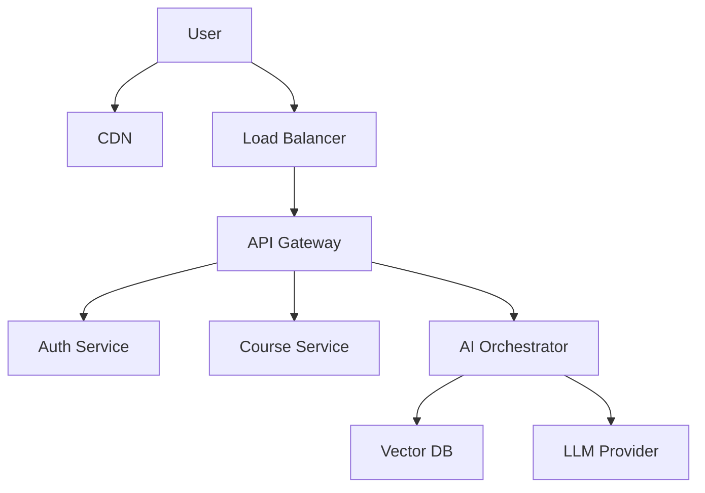

# 🎓 AI Education Platform

<div align="center">

[](https://opensource.org/licenses/MIT)
[]()
[]()

**The Next-Generation Learning Management System.**  
_Built for the AI era, designed for the human mind._

[Vision](#-vision) • [Core Features](#-core-features) • [Architecture](#-architecture) • [Quick Start](#-quick-start)

</div>

---

## 🚀 Vision

We are building the **AI Education Platform** because traditional LMS software is stuck in 2010. It’s static, clunky, and passive.

Our goal is simple: **Active Learning**. By embedding Large Language Models (LLMs) directly into the study workflow, we transform static PDFs into interactive conversations. Students don't just read; they quiz themselves, summarizing complex topics, and get instant feedback—all in real-time.

---

## ✨ Core Features

- **📚 Intelligent Study Materials**: Don't just upload PDFs. Talk to them. Our RAG pipeline allows students to query their textbooks as if they were chatting with a professor.
- **🤖 Always-On Tutor**: A context-aware assistant that knows exactly _which_ lesson you are studying and helps you get unblocked instantly.
- **📝 Dynamic Quizzing**: The system generates unique quizzes every time, focusing on your weak spots (Adaptive Learning).
- **📊 Insightful Analytics**: We track concept mastery, not just login times. Students can see exactly where they need to improve.
- **🔒 Enterprise-Grade Security**: Role-based access control (RBAC) and encrypted data storage ensure privacy is never compromised.

---

## 🛠 Tech Stack

We chose a stack that balances developer velocity with massive scalability.

| Component     | Technology                  | Why we chose it                                         |
| ------------- | --------------------------- | ------------------------------------------------------- |
| **Frontend**  | React, TypeScript, Tailwind | Type safety and component reusability.                  |
| **Backend**   | Node.js (Express)           | Fast I/O for handling thousands of concurrent requests. |
| **AI Layer**  | Python, LangChain, OpenAI   | Python is the native tongue of AI.                      |
| **Database**  | PostgreSQL & Redis          | Reliability (SQL) meets Speed (Caching).                |
| **Vector DB** | Qdrant / Pinecone           | Essential for our RAG (search) capabilities.            |
| **DevOps**    | Docker, K8s                 | Write once, deploy anywhere.                            |

---

## 🏗 Architecture

We didn't just throw this together. It's engineered to handle load.

### The 10,000-Foot View

Traffic flows through our Load Balancer into a robust API Gateway. From there, it's routed to specialized microservices.

> 📖 **Deep Dive**: Check out [System Design](docs/05_System_Design.md) for the full breakdown.



### The AI Engine (RAG)

How does it "know" the course material? It uses **Retrieval-Augmented Generation**. We ingest documents, chunk them, embedding them, and then retrieve relevant context for every user query.

> 🧠 **Learn More**: Read [AI Workflow](docs/06_AI_Workflow.md) to understand the brain of the operation.

---

## 📂 Project Structure

```bash
ai-education-platform/
├── ai-engine/          # Python AI microservices (The Brain)
├── backend/            # Node.js API services (The Body)
├── frontend/           # React application (The Face)
├── database/           # SQL migration scripts
├── docs/               # Architecture decision records
│   ├── diagrams/       # Extracted Mermaid source code
│   └── uml/            # Visual assets
└── assets/             # Static files
```

---

## 🚀 Quick Start

Ready to run this locally? Let's go.

### Prerequisites

- Node.js v18+
- Python 3.9+
- Docker & Docker Compose

### Fast Track Launch

1.  **Clone the repo**

    ```bash
    git clone https://github.com/suvendukungfu/ai-education-platform.git
    cd ai-education-platform
    ```

2.  **Spin up the infrastructure**

    ```bash
    docker-compose up -d --build
    ```

3.  **Launch**
    - Frontend: `http://localhost:3000`
    - API: `http://localhost:8000`

---

## 🤝 Contributing

We love open source. If you want to fix a bug or add a shiny new feature, check out [CONTRIBUTING.md](CONTRIBUTING.md).

---

<div align="center">
Built with ❤️ by the AI Education Team
</div>
