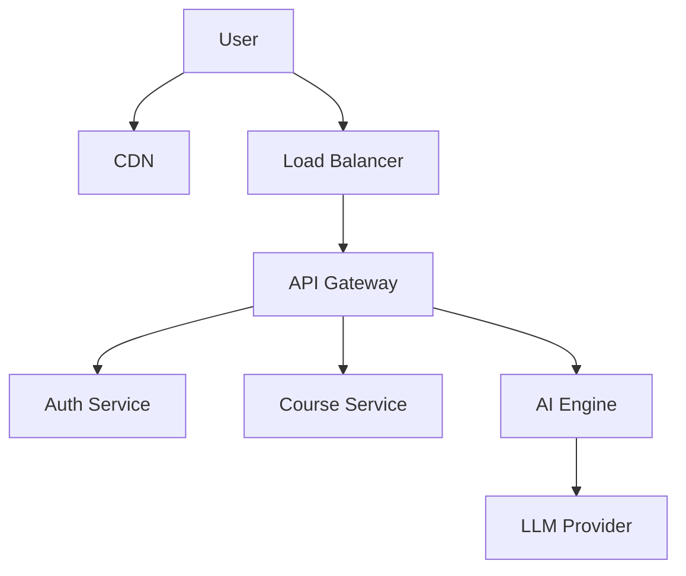

# 🎓 AI Education Platform

<div align="center">

[](https://opensource.org/licenses/MIT)
[]()
[]()
[]()

**The Next-Generation Learning Management System powered by Generative AI.**

[Features](#-features) • [Tech Stack](#-tech-stack) • [Architecture](#-architecture) • [Getting Started](#-getting-started) • [Contributing](#-contributing)

</div>

---

## 🚀 Vision

The **AI Education Platform** revolutionizes traditional learning by integrating advanced **Large Language Models (LLMs)** directly into the study workflow. From generating instant study notes to personalized AI tutoring, we provide a seamless, intelligent educational experience.

## ✨ Features

- 📚 **Smart Study Materials**: Upload PDFs and get instant summaries.
- 🤖 **AI Tutor**: Chat with a context-aware assistant trained on your course material.
- 📝 **Auto-Generated Quizzes**: Turn any document into a practice test instantly.
- 📊 **Learning Analytics**: Track progress with detailed insights and recommendations.
- 🔒 **Enterprise Security**: Role-based access control and encrypted data storage.

## 🛠 Tech Stack

| Component     | Technology                  | Description                |
| ------------- | --------------------------- | -------------------------- |
| **Frontend**  | React, TypeScript, Tailwind | Modern, responsive UI      |
| **Backend**   | Node.js, Express / Python   | Microservices Architecture |
| **Database**  | PostgreSQL, Redis           | Relational data & Caching  |
| **AI Engine** | OpenAI / LangChain          | LLM Orchestration          |
| **Vector DB** | Pinecone / Weaviate         | Semantic Search (RAG)      |
| **DevOps**    | Docker, K8s, GitHub Actions | CI/CD Pipeline             |

## 🏗 Architecture

We employ a high-scalability microservices architecture designed to support millions of concurrent users.

### System Overview

> See [docs/05_System_Design.md](docs/05_System_Design.md) for full details.



### AI Pipeline (RAG)

> See [docs/06_AI_Workflow.md](docs/06_AI_Workflow.md) for the deep dive.

## 📂 Project Structure

```bash
ai-education-platform/
├── assets/             # Static assets
├── ai-engine/          # Python AI microservices (RAG, LLM wrappers)
├── backend/            # Node.js API services
├── database/           # SQL migration scripts & seeds
├── docs/               # Architecture documentation
│   ├── 01_UML_Architecture.md
│   ├── 02_Behavioral_Diagrams.md
│   ├── 03_Structural_Diagrams.md
│   ├── 04_ER_Database_Model.md
│   ├── 05_System_Design.md   <-- NEW (Scalability)
│   └── 06_AI_Workflow.md     <-- NEW (AI Pipeline)
└── frontend/           # React application
```

## 🚀 Getting Started

### Prerequisites

- Node.js v18+
- Python 3.9+
- Docker & Docker Compose

### Installation

1. **Clone the repository**

   ```bash
   git clone https://github.com/suvendukungfu/ai-education-platform.git
   cd ai-education-platform
   ```

2. **Start Services (Docker)**

   ```bash
   docker-compose up -d --build
   ```

3. **Access the App**
   - Frontend: `http://localhost:3000`
   - API: `http://localhost:8000`

## 🤝 Contributing

We welcome contributions! Please see our [CONTRIBUTING.md](CONTRIBUTING.md) for details on how to get started.

---

<div align="center">
Built with ❤️ by the AI Education Team
</div>
