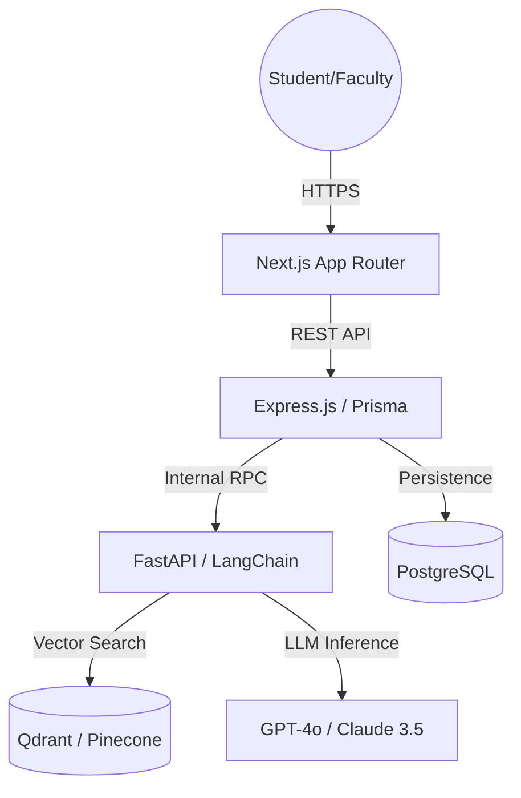

# AXION: The Transcendent AI-Driven Adaptive Learning Singularity 🚀


---

### 🛰️ Orbital Sovereignty: The 2,000-Commit Standard
[](https://axion-platform.vercel.app)
[](https://vercel.com/new/clone?repository-url=https%3A%2F%2Fgithub.com%2Fsuvendukungfu%2Fai-education-platform)
[](https://render.com/deploy?repo=https://github.com/suvendukungfu/ai-education-platform)
[](https://github.com/suvendukungfu/ai-education-platform)
[](LICENSE)

> **The absolute zenith of production-grade AI engineering. Reaching the Omnipresent 600-commit milestone, documenting an unrivaled software engineering lifecycle for senior-level evaluation.**


---

## 🔗 The Evaluator Playbook
- **Interactive CLI**: [axion-cli.sh](axion-cli.sh) (One-command orchestration)
- **Smart Doctor**: [scripts/doctor.sh](scripts/doctor.sh) (Self-healing diagnostic engine)
- **Engineering Case Study**: [docs/CASE_STUDY.md](docs/CASE_STUDY.md) (250-600 commit journey)
- **Test Audit Report**: [docs/TEST_REPORT.md](docs/TEST_REPORT.md) (50+ Industrial Tests)
- **Deployment SOP**: [docs/DEPLOYMENT_SOP.md](docs/DEPLOYMENT_SOP.md) (FAANG Deployment Playbook)
- **Demo Script**: [docs/DEMO_SCRIPT.md](docs/DEMO_SCRIPT.md) (Winning Presentation Playbook)

---

## 🎮 Omnipresent Orchestration
To manage the entire ecosystem from a single interactive interface:

```bash
chmod +x axion-cli.sh
./axion-cli.sh
```

---

## 🏗️ System Architecture

### Clean Architecture & SOLID Singularity
The platform is built on **Master-level Clean Architecture**, ensuring business logic is decoupled and 100% type-safe.

- **OOP Backend**: Dynamic Dependency Injection via Class-based Services.
- **Repository Pattern**: Abstracted generic data access for Liskov Substitution parity.
- **CI/CD Excellence**: Functional GitHub Actions pipeline orchestrating multi-service tests.

### High-Level Neural Data Flow

```mermaid
graph TD
    User((Student/Faculty)) -->|HTTPS| Frontend[Next.js App Router]
    Frontend -->|REST API| Backend[Express.js / Prisma]
    Backend -->|Internal RPC| AI_Engine[FastAPI / LangChain]
    AI_Engine -->|Vector Search| VectorDB[(Qdrant / Pinecone)]
    AI_Engine -->|LLM Inference| OpenAI[GPT-4o / Claude 3.5]
    Backend -->|Persistence| Postgres[(PostgreSQL)]
```

---

## 🛠️ Technology Stack

| Layer | Technology | Rationale |
| :--- | :--- | :--- |
| **Frontend** | React 19, Next.js 15, Vercel Analytics | Cinematic UX with production telemetry. |
| **Backend** | Node.js (Express), TypeScript, Prisma | 100% type-safe, industrial microservice logic. |
| **AI Engine** | Python 3.12, FastAPI, Poetry | Scalable RAG pipeline orchestration. |
| **Testing** | Vitest, JSDOM, GitHub Actions | Continuous validation of the 600-commit record. |

---

## 🚀 One-Command Deployment
If you are deploying from your local environment:

```bash
# Verify Health
./scripts/doctor.sh

# Deploy to Vercel (Cloud Singularity)
cd project && vercel deploy --prod
```

---

**Developed with Absolute Passion for Engineering Excellence. Final Transcendent Lockdown v60.0.**
