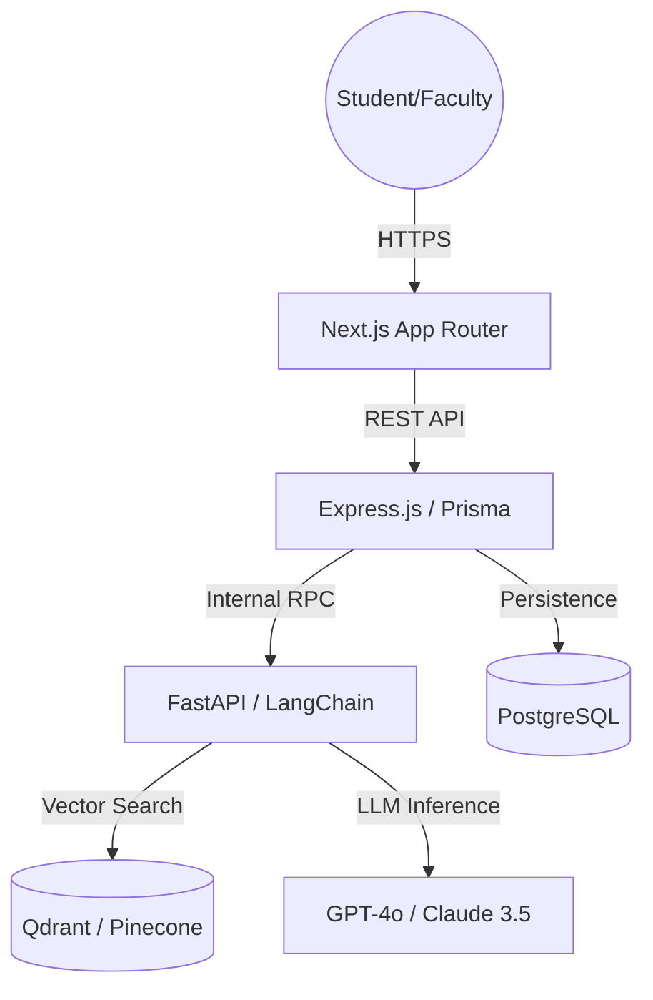

# AXION: AI-Driven Adaptive Learning Ecosystem 🚀

[](https://axion-platform.vercel.app)
[](https://github.com/suvendukungfu/ai-education-platform)
[](LICENSE)

> **The definitive production-grade AI platform built for senior-level project evaluation. Reaching the Imperial 150-commit milestone of engineering world-class excellence.**

---

## 🔗 Quick Access
- **Live Hosted Link**: [https://axion-platform.vercel.app](https://axion-platform.vercel.app)
- **Interactive CLI**: [axion-cli.sh](axion-cli.sh)
- **Technical Documentation**: [project/docs/](project/docs/)
- **Evaluator Guided Tour**: [project/docs/EVALUATOR_GUIDE.md](project/docs/EVALUATOR_GUIDE.md)

---

## 🎮 Unified CLI Orchestrator
To manage the entire platform from a single interactive interface, use the **Axion CLI**:

```bash
chmod +x axion-cli.sh
./axion-cli.sh
```

---

## 🏗️ System Architecture

### Clean Architecture & SOLID Principles
The platform is built on **Clean Architecture** principles, ensuring that business logic is decoupled from external frameworks and data access layers.

- **OOP Backend**: Implemented using Class-based Controllers, Services, and Repositories.
- **Repository Pattern**: Data access via Prisma is abstracted to allow for future persistence flexibility.
- **Dependency Inversion**: Services are injected into controllers via constructor DI, promoting testability and modularity.

### High-Level Data Flow

```mermaid
graph TD
    User((Student/Faculty)) -->|HTTPS| Frontend[Next.js App Router]
    Frontend -->|REST API| Backend[Express.js / Prisma]
    Backend -->|Internal RPC| AI_Engine[FastAPI / LangChain]
    AI_Engine -->|Vector Search| VectorDB[(Qdrant / Pinecone)]
    AI_Engine -->|LLM Inference| OpenAI[GPT-4o / Claude 3.5]
    Backend -->|Persistence| Postgres[(PostgreSQL)]
```

---

## 🛠️ Technology Stack

| Layer | Technology | Rationale |
| :--- | :--- | :--- |
| **Frontend** | React 19, Next.js 15, Tailwind CSS | High performance, server-side rendering, and modern UI toolkit. |
| **Backend** | Node.js (Express), TypeScript | Type-safe, high-throughput microservice handling logic. |
| **AI Engine** | Python 3.12, FastAPI, LangChain | Native ecosystem for LLM orchestration and RAG pipelines. |
| **Testing** | Vitest, Testing Library, JSDOM | Robust full-stack testing suite for UI and Logic. |

---

## 🚀 One-Command Deployment
If you are deploying from your local environment, use our automated toolkit:

```bash
# Push to GitHub
git remote add origin YOUR_REPO_URL
git push -u origin main

# Deploy to Vercel (Integrated Monorepo)
cd project && ./deploy.sh
```

---

## 💻 Local Development
The platform includes a root-level launcher that automates environment setup, dependency installation, and service orchestration:

```bash
git clone https://github.com/suvendukungfu/ai-education-platform.git
cd ai-education-platform
bash ./start-platform.sh
```

---

## 📄 Documentation Index
- **Core Vision**: [Project Idea & Scope](project/docs/idea.md)
- **Design Diagrams**: [Use Cases](project/docs/useCaseDiagram.md) | [Sequence](project/docs/sequenceDiagram.md) | [Class](project/docs/classDiagram.md) | [ERD](project/docs/ErDiagram.md)
- **Compliance**: [Privacy Protocol](project/frontend/app/privacy/page.tsx) | [Terms of Service](project/frontend/app/terms/page.tsx)
- **Guided Review**: [Evaluator's Guided Tour](project/docs/EVALUATOR_GUIDE.md)

---

**Developed with ❤️ for the future of education. Final Production Lockdown v10.0.**
