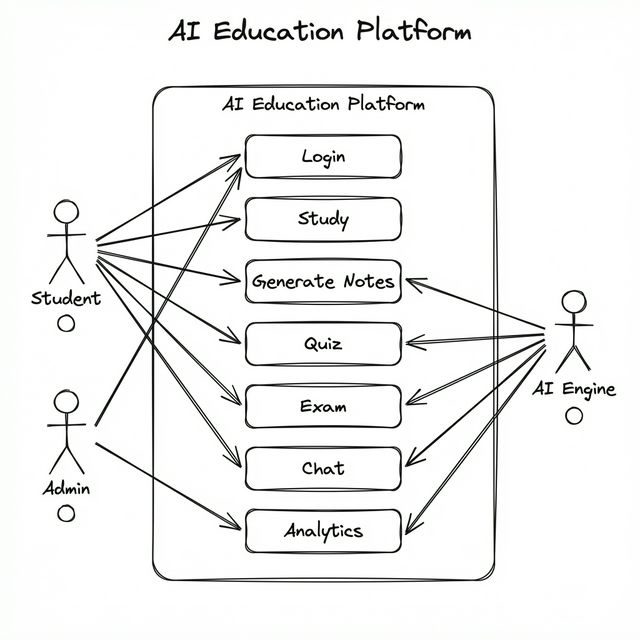
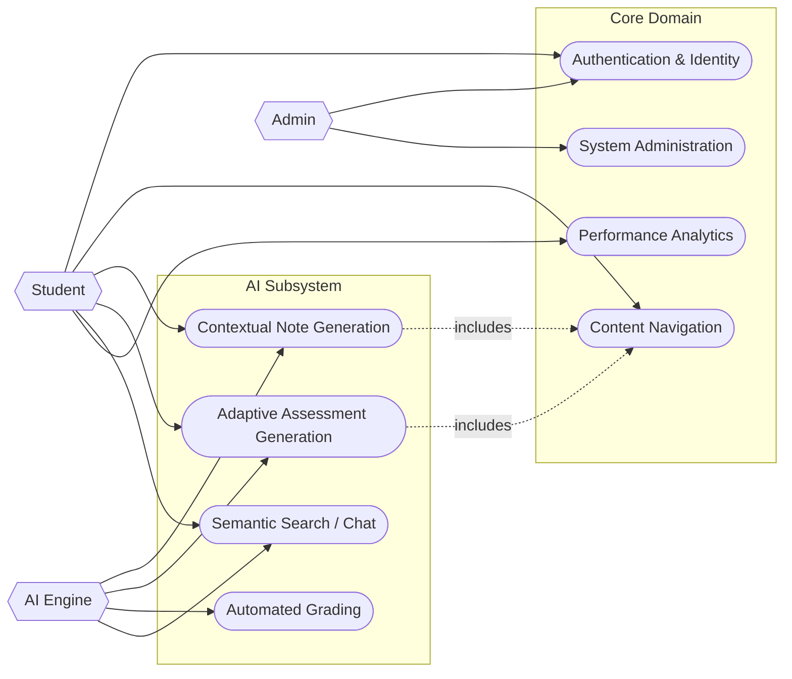

# Architecture & Use Case Definitions

This document serves as the high-level architectural contract for the AI Education Platform. It defines the system boundaries, actor interactions, and the primary functional requirements that drive the technical design.

## System Boundaries and Actors

The system is architected to support three distinct primary actors, each with specific privilege levels and interaction patterns.

- **Student**: The primary end-user. Interactions are focused on content consumption, assessment generation, and analytics viewing. Low-privilege access.
- **Admin/Instructor**: System managers. Interactions involve content creation, user management, and system configuration. High-privilege access.
- **AI Engine**: A non-human actor (in UML terms) representing the autonomous agents responsible for content generation and grading.

### Visual Architecture Reference





---

## Component Architecture

To ensure separation of concerns and maintainability, the backend is divided into logical domains. This aligns with Domain-Driven Design (DDD) principles.

1.  **Identity Domain (`Auth Service`)**: Handles JWT issuance, validation, and user profile management.
2.  **Curriculum Domain (`Course Service`)**: Manages the hierarchy of Courses, Modules, and Lessons.
3.  **Assessment Domain (`Assessment Service`)**: Encapsulates logic for Quiz/Exam generation and scoring.
4.  **Intelligence Domain (`AI Service`)**: Wraps LLM interactions and manages vector store operations.

### Component Interaction Diagram

This diagram illustrates the dependencies between the logical service components.

```mermaid
componentDiagram
    package "Public Interface" {
        component "API Gateway" as Gateway
    }

    package "Service Layer" {
        component "Auth Service" as Auth
        component "Course Service" as Course
        component "AI Orchestrator" as AI
        component "Analytics Engine" as Analytics
    }

    package "Persistence Layer" {
        database "PostgreSQL (Relational)" as DB
        database "Qdrant (Vector)" as VectorDB
    }

    Gateway --> Auth : HTTPS/JSON
    Gateway --> Course : HTTPS/JSON
    Gateway --> AI : HTTPS/JSON

    Course --> DB : Read/Write
    Auth --> DB : Read/Write
    Analytics --> DB : Aggregation

    AI ..> Course : Pub/Sub (Events)
    AI --> VectorDB : Embedding Ops
    AI --> DB : Context Retrieval
```

## Architectural Decisions (ADRs) Summary

- **ADR-001: Separation of AI Logic**: The AI Orchestrator is a separate service to allow for Python-based tooling optimization without constraining the Node.js API services.
- **ADR-002: Async Processing for Generation**: All content generation tasks (Notes, Quizzes) are asynchronous to prevent HTTP timeouts and improve user perceived performance.
- **ADR-003: Postgres as Primary Source of Truth**: While RAG uses a Vector DB, all canonical data (User records, Course content) resides in PostgreSQL to ensure ACID compliance.
