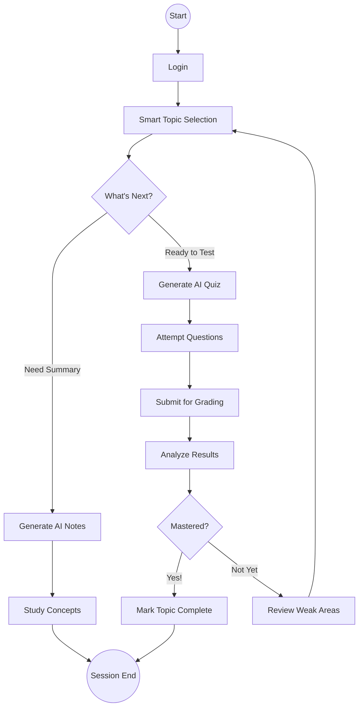
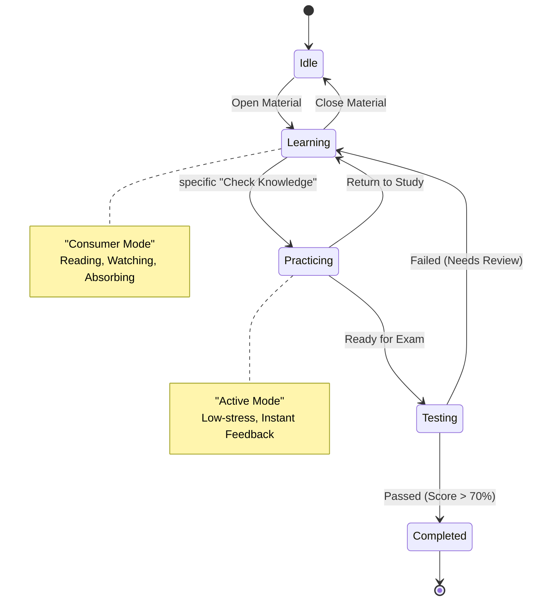

# Behavioral Flows: The Student Experience

Static structures are important, but software really comes alive in its _behavior_. This document captures the dynamic stories of our users—how they move through the system, make decisions, and evolve their learning.

### The Flow of Interaction


```mermaid
sequenceDiagram
    autonumber
    actor Student
    participant UI as "Frontend UI"
    participant API as "Backend API"
    participant AI as "AI Service"
    participant DB as "Database"

    %% 1. Authentication
    Student->>UI: Login(email, password)
    UI->>API: POST /auth/login
    API->>DB: Validate Credentials
    DB-->>API: User Found
    API-->>UI: Return Auth Token

    %% 2. Study Phase
    Student->>UI: Select Topic (e.g., "Machine Learning")
    UI->>API: GET /courses/topic/{id}
    API->>DB: Fetch Content
    DB-->>API: Return Content
    API-->>UI: Display Lesson

    %% 3. AI Notes Generation
    Student->>UI: Click "Generate AI Summaries"
    UI->>API: POST /ai/generate-notes
    API->>AI: Request Summary (Lesson Content)
    activate AI
    AI-->>API: Return Generated Notes
    deactivate AI
    API->>DB: Save Notes
    API-->>UI: Display Notes

    %% 4. Practice Phase (Quiz)
    Student->>UI: Create Practice Quiz
    UI->>API: POST /quiz/create
    API->>AI: Generate Questions (Topic)
    AI-->>API: Return Quiz JSON
    API-->>UI: Render Quiz
    Student->>UI: Submit Answers
    UI->>API: POST /quiz/submit
    API->>DB: Store Results

    %% 5. Assessment Phase (Exam) & Analytics
    Student->>UI: Attempt Exam
    UI->>API: Start Exam Session
    ... (Exam Interaction) ...
    Student->>UI: Submit Exam
    UI->>API: POST /exam/submit
    API->>DB: Calculate & Store Score

    API->>DB: Update Analytics (Progress + Score)
    API-->>UI: Return Exam Result & New Analytics
    UI-->>Student: Show Scorecard
```

---

## 1. The Learning Journey

Let's trace the path of a dedicated student. It's a journey that starts with curiosity and ends with mastery.

**The Narrative:**

1.  **Discovery**: The student logs in and selects a complex topic (e.g., "Machine Learning").
2.  **Synthesis**: Overwhelmed by raw content, they ask the AI to **Generate Notes**. The system crunches the data and serves up a concise summary.
3.  **Practice**: Feeling confident, they generate a **Quiz**. The AI creates questions _on the fly_ based on exactly what they just studied.
4.  **Validation**: They take an **Exam**, and immediately, the system updates their **Analytics**. They don't just see a score; they see growth.

---

## 2. Decision Points (Activity Diagram)

Students don't always follow a linear path. They explore. This diagram maps out the decisions a student makes during a study session. Do they dive deep into notes? Do they test themselves? If they fail, do they review?

It's a continuous loop of **Action -> Feedback -> Improvement**.

### The Study Loop



---

## 3. Modes of Engagement (State Machine)

A student isn't just "online". They are in specific mental states. Understanding these states allows us to tailor the interface to their current need.

- **Idle**: Browsing, deciding.
- **Learning**: Deep focus. We minimize distractions here.
- **Practicing**: Active recall. Low stakes, high feedback.
- **Testing**: High stakes. Timed, secure environment.
- **Completed**: Celebration and reflection.

### User State Transitions


