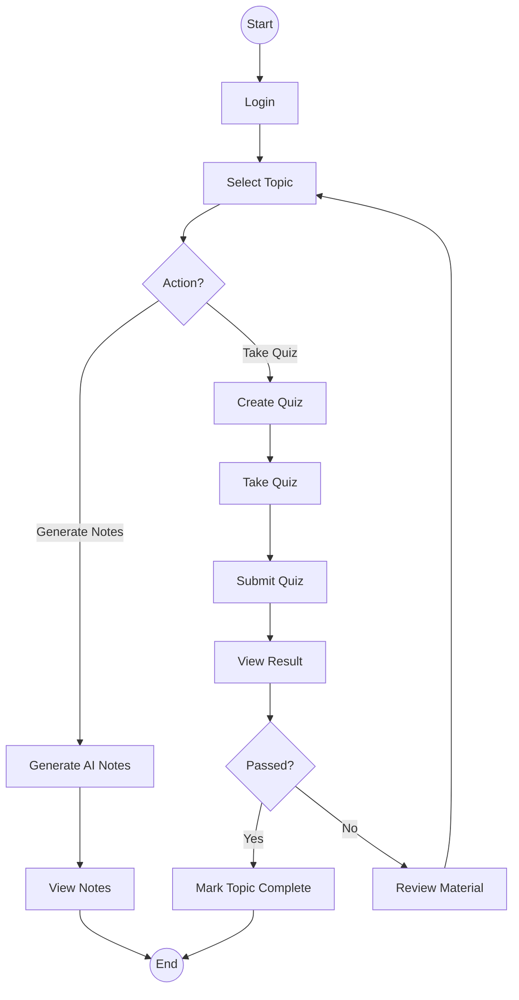
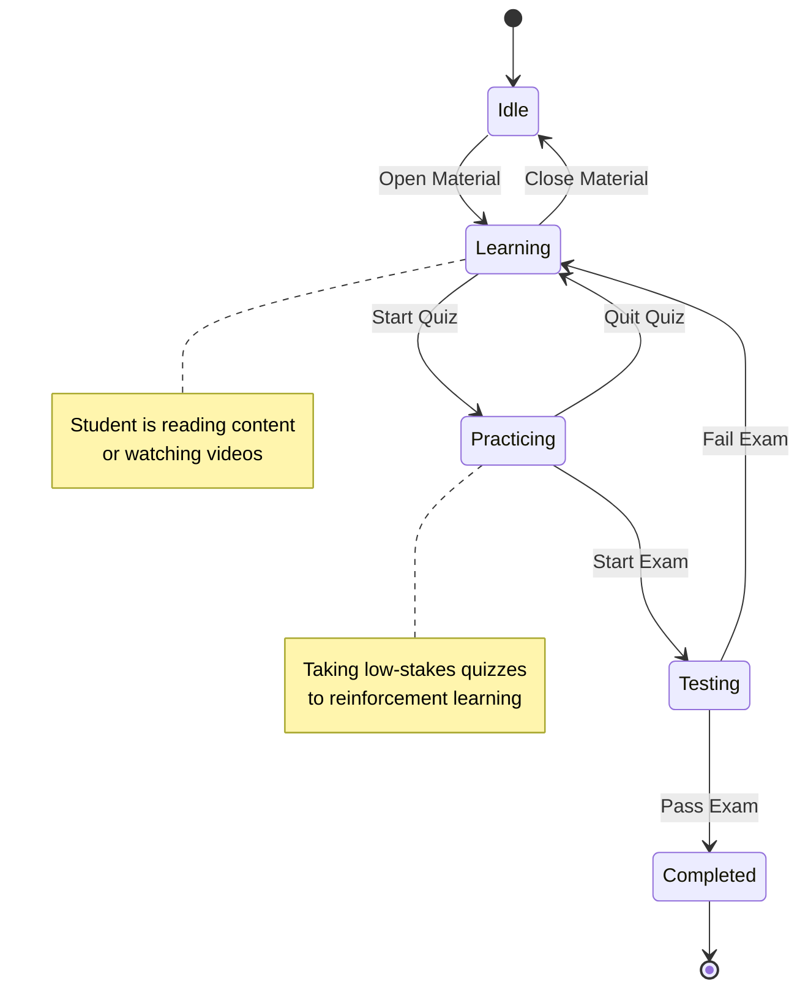

# Behavioral Diagrams

## Sequence Diagram

**Scenario:** End-to-End Student Learning Flow (Login → Study → Quiz → Exam → Analytics)

### Diagram

```mermaid
sequenceDiagram
    autonumber
    actor Student
    participant UI as "Frontend UI"
    participant API as "Backend API"
    participant AI as "AI Service"
    participant DB as "Database"

    %% 1. Authentication
    Student->>UI: Login(email, password)
    UI->>API: POST /auth/login
    API->>DB: Validate Credentials
    DB-->>API: User Found
    API-->>UI: Return Auth Token

    %% 2. Study Phase
    Student->>UI: Select Topic (e.g., "Machine Learning")
    UI->>API: GET /courses/topic/{id}
    API->>DB: Fetch Content
    DB-->>API: Return Content
    API-->>UI: Display Lesson

    %% 3. AI Notes Generation
    Student->>UI: Click "Generate AI Summaries"
    UI->>API: POST /ai/generate-notes
    API->>AI: Request Summary (Lesson Content)
    activate AI
    AI-->>API: Return Generated Notes
    deactivate AI
    API->>DB: Save Notes
    API-->>UI: Display Notes

    %% 4. Practice Phase (Quiz)
    Student->>UI: Create Practice Quiz
    UI->>API: POST /quiz/create
    API->>AI: Generate Questions (Topic)
    AI-->>API: Return Quiz JSON
    API-->>UI: Render Quiz
    Student->>UI: Submit Answers
    UI->>API: POST /quiz/submit
    API->>DB: Store Results

    %% 5. Assessment Phase (Exam) & Analytics
    Student->>UI: Attempt Exam
    UI->>API: Start Exam Session
    ... (Exam Interaction) ...
    Student->>UI: Submit Exam
    UI->>API: POST /exam/submit
    API->>DB: Calculate & Store Score

    API->>DB: Update Analytics (Progress + Score)
    API-->>UI: Return Exam Result & New Analytics
    UI-->>Student: Show Scorecard
```

---

## Activity Diagram

**Steps:**

- Login
- Select Topic
- Generate Notes
- Create Quiz
- Take Exam
- View Result

### Diagram



---

## State Machine Diagram

**States:**

- Idle
- Learning
- Practicing
- Testing
- Completed

### Diagram


