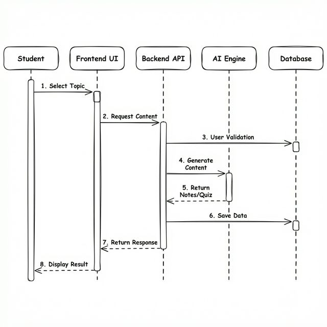
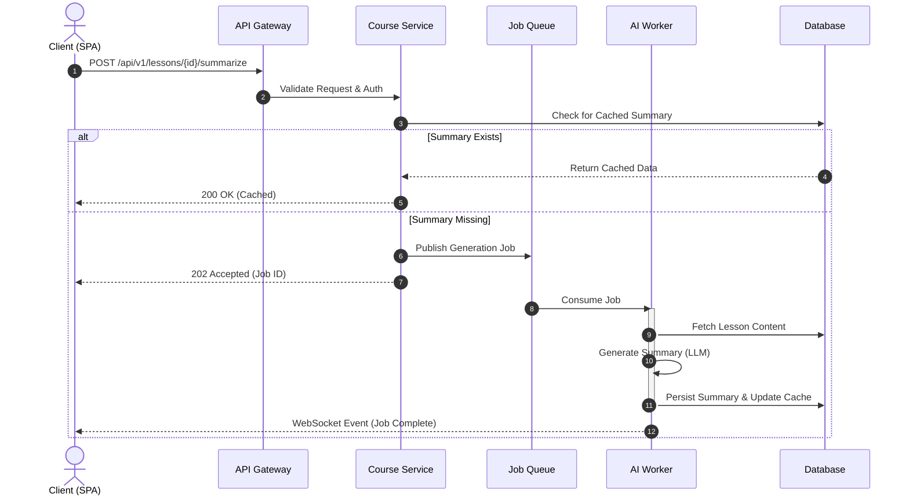
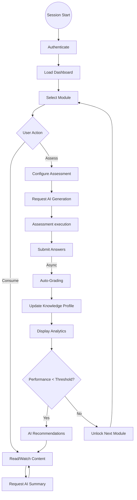
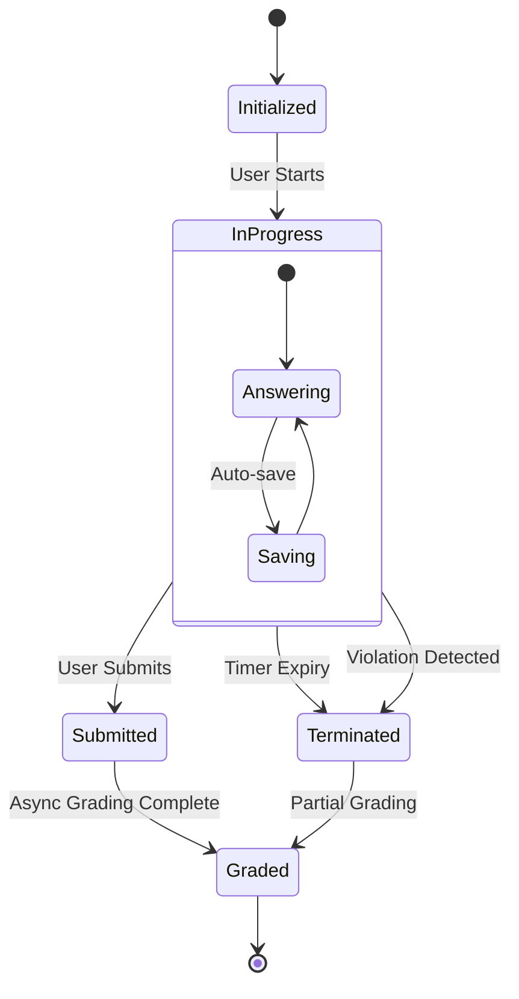

# Behavioral Specifications

This document defines the runtime behavior of the system, detailing the interactions between objects and the state transitions of key entities. It serves as a guide for implementing business logic and concurrency controls.

## 1. Request Lifecycle: Content Generation

A critical flow in the system is the **Asynchronous Content Generation** pipeline. This process involves coordination between the frontend client, the API, the database, and the AI worker execution environment.

### Sequence Diagram

**Key Technical Considerations:**

- **Idempotency**: Requests to generate content should be idempotent to prevent duplicate processing costs.
- **Optimistic UI**: The frontend should respond immediately to the user while polling or waiting for a WebSocket event for the completion of the generation task.
- **Error Handling**: The system must gracefully handle LLM API timeouts or rate limits (HTTP 429).

---

## 2. Activity Workflow: The Study Loop

The student's study session is modeled as a cyclic process of **Consumption**, **Assessment**, and **Review**. This workflow drives the analytics engine.

### Activity Diagram

---

## 3. Entity State Management (State Machines)

To manage complex entity lifecycles, we employ explicit state machines. This is particularly crucial for the **Exam/Assessment** entity to prevent cheating and ensure data consistency.

### Exam Session State Machine

**States:**

- **Initialized**: Exam created, configuration loaded, but not started.
- **InProgress**: Timer running, interactions logged. Locked to specific client session.
- **Submitted**: User finished, awaiting grading.
- **Graded**: Scoring complete, results available.
- **Terminated**: Forcefully closed due to timeout or violation.

