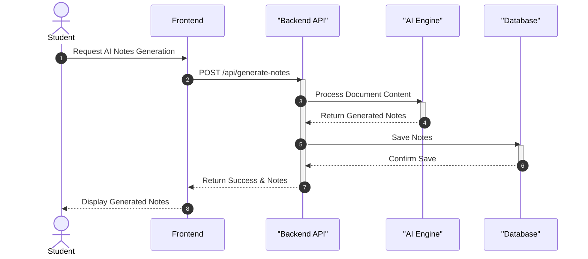
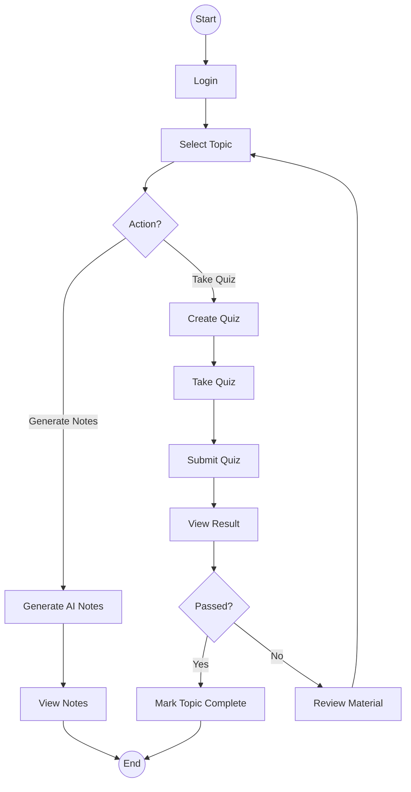
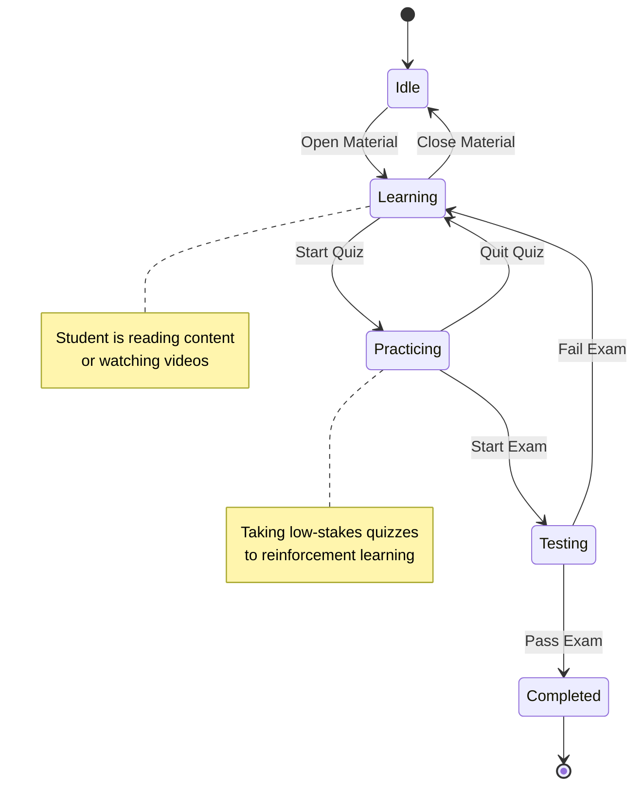

# Behavioral Diagrams

## Sequence Diagram

**Flow:** Student → Frontend → Backend API → AI Engine → Database → Response

### Diagram

---

## Activity Diagram

**Steps:**

- Login
- Select Topic
- Generate Notes
- Create Quiz
- Take Exam
- View Result

### Diagram

---

## State Machine Diagram

**States:**

- Idle
- Learning
- Practicing
- Testing
- Completed

### Diagram

