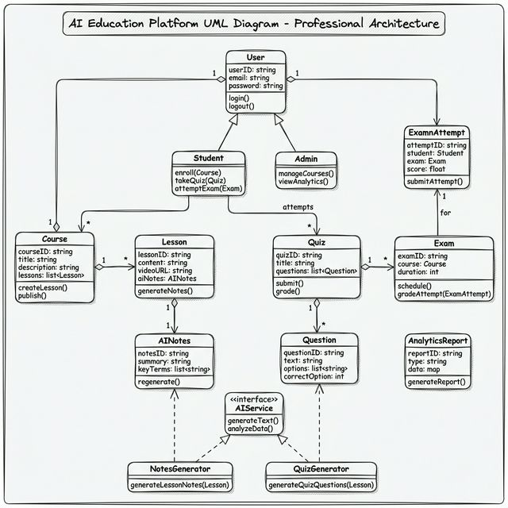
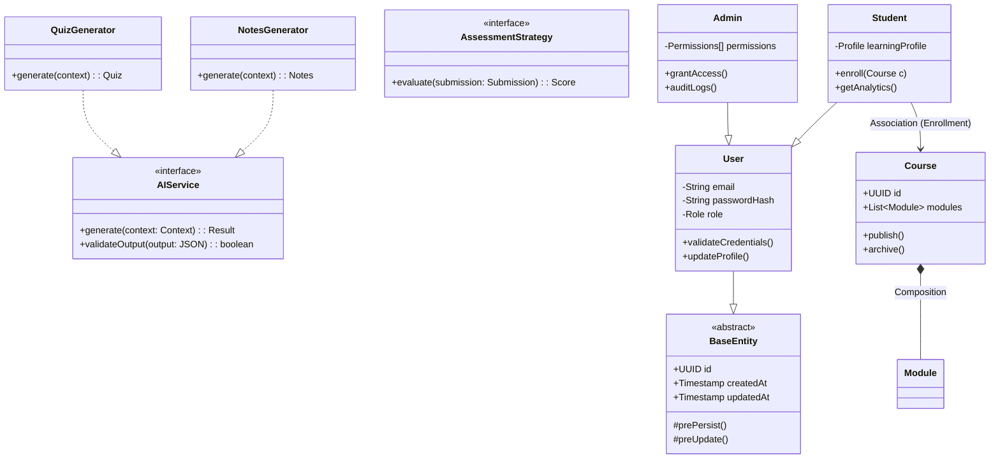

# Structural Design & Code Organization

This document outlines the static structure of the codebase, focusing on class hierarchies, interface definitions, and package modularity. It emphasizes the application of Object-Oriented Design (OOD) principles, specifically SOLID patterns, to ensure scalability and testability.

## 1. Class Hierarchy and Domain Model

We use a rich domain model pattern. Entities are not just data containers (DTOs); they encapsulate behavior and validation logic.

**Key Design Patterns:**

- **Strategy Pattern**: Used in the `AIService` implementation (`NotesGenerator`, `QuizGenerator`) to allow runtime swapping of diverse generation algorithms or LLM providers.
- **Template Method**: The `BaseEntity` provides common lifecycle hooks (`onCreate`, `onUpdate`) that subclasses (`User`, `Course`) inherit and extend.
- **Factory Pattern**: Used to instantiate complex Assessment objects based on configuration parameters.

### Class Diagram





---

## 2. Package Architecture & Dependencies

The application relies on strict package boundaries to prevent cyclic dependencies and "spaghetti code." We adhere to a **Layered Architecture**:

1.  **Presentation Layer (`api`)**: Controllers and DTOs.
2.  **Business Layer (`service`)**: Core logic and transaction boundaries.
3.  **Data Access Layer (`repository`)**: Database interaction and query abstractions.
4.  **Integration Layer (`client`)**: External API clients (OpenAI, Stripe, etc.).

### Package Wiring Diagram

```mermaid
packageDiagram
    package "com.edutech.core" {
        [Domain Entities]
        [Repository Interfaces]
    }

    package "com.edutech.service" {
        [AuthService]
        [CourseService]
        [AssessmentService]
    }

    package "com.edutech.api" {
        [RestControllers]
        [GraphQLResolvers]
    }

    package "com.edutech.infrastructure" {
        [PostgresRepositoryImpl]
        [RedisCacheImpl]
        [OpenAIClient]
    }

    %% Dependency Flow (Inversion of Control)
    "com.edutech.api" ..> "com.edutech.service" : Uses
    "com.edutech.service" ..> "com.edutech.core" : Uses

    %% Infrastructure implements Core Interfaces
    "com.edutech.infrastructure" --|> "com.edutech.core" : Implements
```

**Architectural Enforcement:**

- Controllers **never** talk directly to Repositories.
- Domain entities **never** depend on Infrastructure implementation details.
