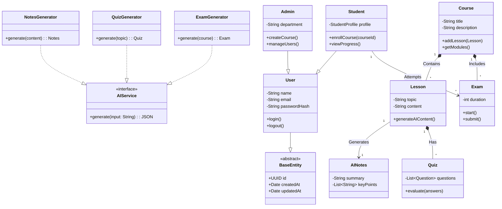

# Structural Diagrams

## Class Diagram

This diagram visualizes the Object-Oriented Design (OOP) of the backend services.

**Key Design Patterns:**

- **Inheritance**: `User` is the base class for `Student` and `Admin`.
- **Abstraction**: `AIService` defines the contract for AI operations.
- **Polymorphism**: `NotesGenerator`, `QuizGenerator`, and `ExamGenerator` implement `AIService`.
- **Encapsulation**: Private fields (denoted by `-`) protected by public methods.

### Diagram



---

## Package Diagram

**Packages:**

- `com.edutech.auth`
- `com.edutech.course`
- `com.edutech.ai`
- `com.edutech.assessment`
- `com.edutech.analytics`
- `com.edutech.common`

### Diagram

```mermaid
packageDiagram
    package "com.edutech.common" {
        [Utils]
        [BaseEntity]
    }

    package "com.edutech.auth" {
        [AuthService]
        [UserController]
    }

    package "com.edutech.course" {
        [CourseService]
        [LessonManager]
    }

    package "com.edutech.ai" {
        [LLMClient]
        [PromptEngine]
    }

    package "com.edutech.assessment" {
        [QuizGenerator]
        [ExamEvaluator]
    }

    package "com.edutech.analytics" {
        [ProgressTracker]
        [ReportGenerator]
    }

    "com.edutech.auth" ..> "com.edutech.common"
    "com.edutech.course" ..> "com.edutech.common"
    "com.edutech.ai" ..> "com.edutech.common"

    "com.edutech.assessment" ..> "com.edutech.course"
    "com.edutech.assessment" ..> "com.edutech.ai"
    "com.edutech.analytics" ..> "com.edutech.assessment"
    "com.edutech.analytics" ..> "com.edutech.course"
```
