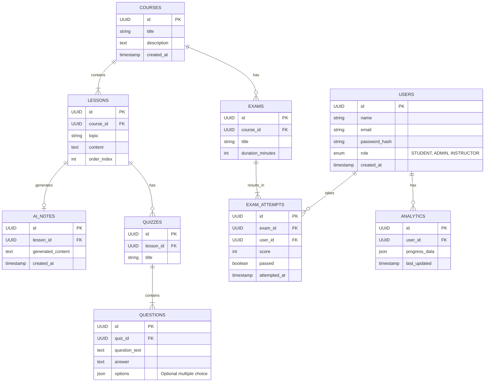

# Database ER Model

## ER Diagram

This diagram represents the normalized database schema for the AI Education Platform.

**Core Entities:**

- **Users**: Central identity table with role-based access.
- **Courses/Lessons**: Hierarchical content structure.
- **AI Notes**: Generated content linked to lessons.
- **Assessments**: Quizzes (practice) and Exams (evaluation).
- **Analytics**: Performance tracking.

### Diagram

