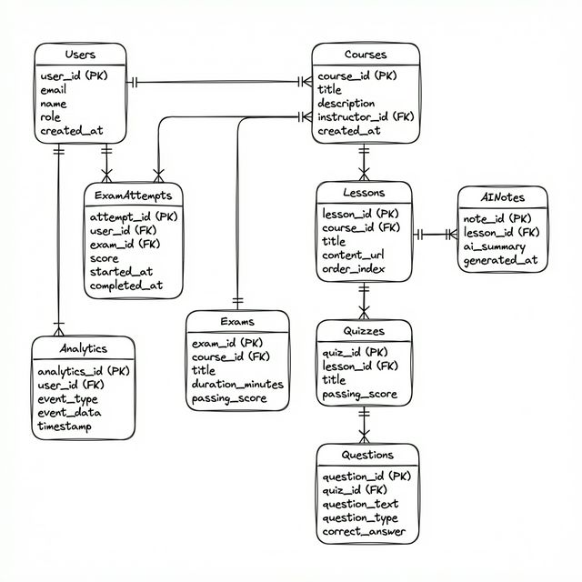
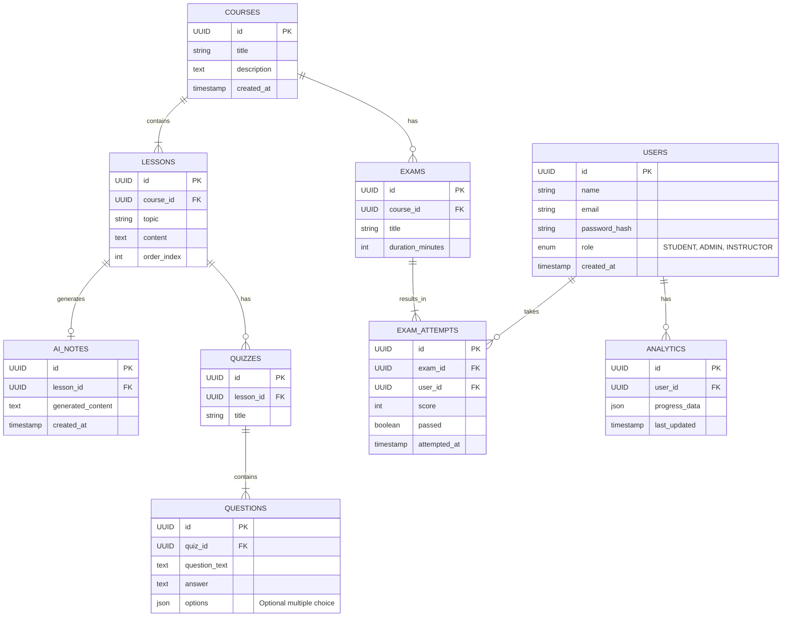

# Database Design: The Foundation

Data is the lifeblood of our platform. We've designed a normalized, relational schema that ensures integrity without sacrificing performance. Every table serves a clear purpose, and every relationship is strictly defined.

### Entity Relationship Diagram (ERD)

---

## The Data Story

1.  **Identity (Users)**: This is where it starts. A `User` is the central entity, capable of being a student, admin, or instructor.
2.  **Content Hierarchy (Courses & Lessons)**: Content isn't just a blob. It's structured. A `Course` holds multiple `Lessons`, creating a clear learning path.
3.  **Generated Value (AI Notes)**: When AI creates content, it's not ephemeral. We store `AI_Notes` linked directly to lessons, so students can revisit them anytime.
4.  **Assessment & Growth**: We don't just store questions (`Questions`); we track every single attempt (`Exam_Attempts`). This allows our `Analytics` engine to see _how_ a student is improving over time, not just where they are today.
