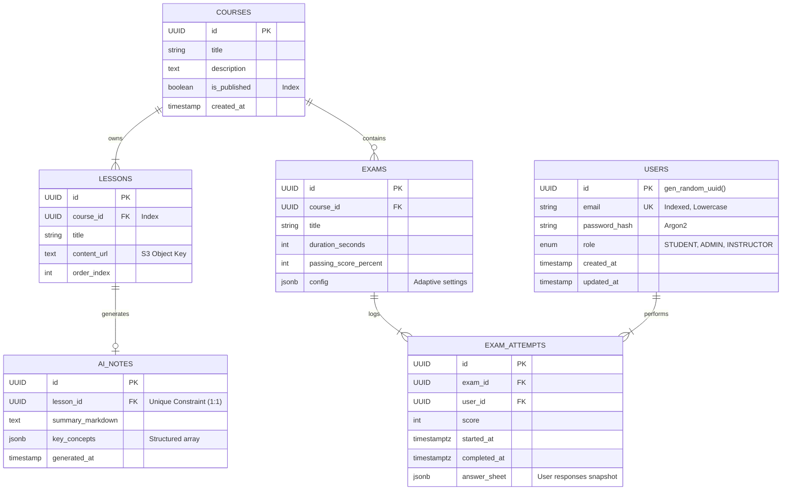

# Database Schema & Data Modeling

The platform utilizes a **PostgreSQL** relational database for its primary data store. The schema is normalized to **3NF** (Third Normal Form) to ensure data integrity and reduce redundancy.

## Design Philosophy

- **Referential Integrity**: Strict Foreign Key constraints are enforced at the database level to prevent orphaned records (e.g., an `ExamAttempt` cannot exist without a valid `User` and `Exam`).
- **Indexing Strategy**: Indices are applied to high-cardinality columns used in `WHERE` clauses (e.g., `email`, `course_id`) and Foreign Keys to optimize join performance.
- **JSONB Hybrid**: We utilize PostgreSQL's `JSONB` type for the `Analytics` and `Question.options` columns. This allows for semi-structured data flexibility (schema-on-read) within a rigid relational environment, particularly useful for evolving analytics metrics.

## Entity Relationship Diagram (ERD)

## Schema Details

### 1. `AI_NOTES`

Stores the output of the RAG pipeline.

- **Constraint**: A `LESSON` can have only ONE associated `AI_NOTE` record (One-to-One).
- **Data Type**: `key_concepts` is stored as `JSONB` to allow for efficient querying of specific concepts across all notes (e.g., "Find all notes mentioning 'Thermodynamics'").

### 2. `EXAM_ATTEMPTS`

This is an immutable log of user activity.

- **Immutability**: Once written, these records represent a historical fact and are rarely updated, only inserted.
- **Snapshotting**: The `answer_sheet` JSONB column stores the exact state of the questions and answers _at the time of the exam_, protecting against future changes to the source questions.
