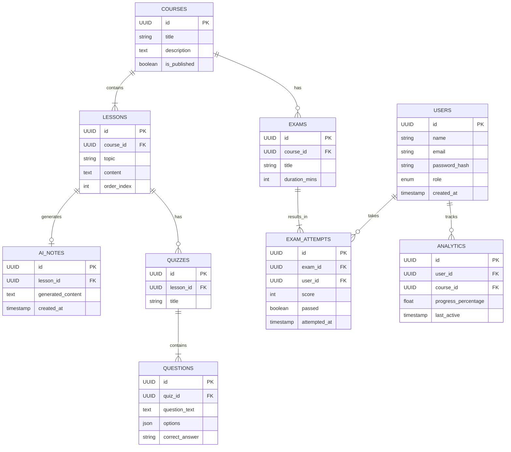

# Database ER Model

## ER Diagram

**Tables:**

- `Users`
- `Courses`
- `Lessons`
- `AINotes`
- `Quizzes`
- `Questions`
- `Exams`
- `ExamAttempts`
- `Analytics`

### Diagram

```mermaid
erDiagram
    USERS {
        UUID id PK
        string name
        string email
        string password_hash
        enum role
        timestamp created_at
    }

    COURSES {
        UUID id PK
        string title
        text description
        boolean is_published
    }

    LESSONS {
        UUID id PK
        UUID course_id FK
        string topic
        text content
        int order_index
    }

    AI_NOTES {
        UUID id PK
        UUID lesson_id FK
        text generated_content
        timestamp created_at
    }

    QUIZZES {
        UUID id PK
        UUID lesson_id FK
        string title
    }

    QUESTIONS {
        UUID id PK
        UUID quiz_id FK
        text question_text
        json options
        string correct_answer
    }

    EXAMS {
        UUID id PK
        UUID course_id FK
        string title
        int duration_mins
    }

    EXAM_ATTEMPTS {
        UUID id PK
        UUID exam_id FK
        UUID user_id FK
        int score
        boolean passed
        timestamp attempted_at
    }

    ANALYTICS {
        UUID id PK
        UUID user_id FK
        UUID course_id FK
        float progress_percentage
        timestamp last_active
    }

    USERS ||--o{ EXAM_ATTEMPTS : takes
    USERS ||--o{ ANALYTICS : tracks
    COURSES ||--|{ LESSONS : contains
    COURSES ||--o{ EXAMS : has
    LESSONS ||--o| AI_NOTES : generates
    LESSONS ||--o{ QUIZZES : has
    QUIZZES ||--|{ QUESTIONS : contains
    EXAMS ||--|{ EXAM_ATTEMPTS : results_in
```
