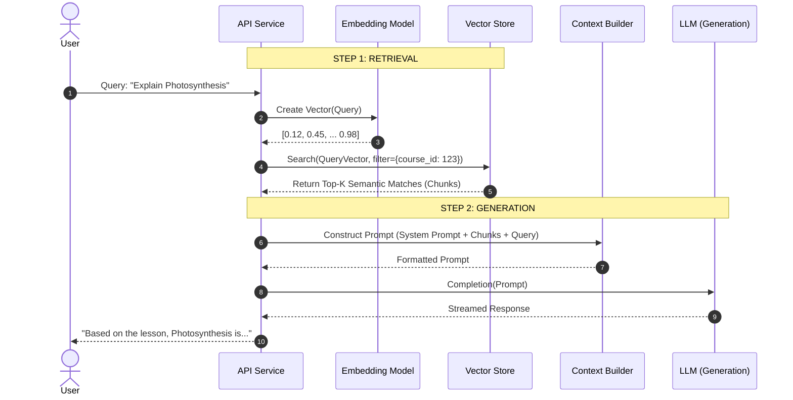

# AI Workflow: Retrieval-Augmented Generation (RAG)

This document details the implementation of the RAG pipeline, explaining how we ground Large Language Models (LLMs) in our proprietary course data to provide accurate, context-aware responses.

## Why RAG?

Standard LLMs (GPT-4, Claude) are trained on general internet data. They lack knowledge of our specific private course content and can confidently "hallucinate" incorrect information. RAG mitigates this by retrieving relevant facts from our database and injecting them into the LLM's context window before it generates an answer.

## The Pipeline

The workflow consists of two distinct phases: **Ingestion (Indexing)** and **Inference (Retrieval & Generation)**.

### Phase 1: Ingestion (Offline Processing)

This process converts unstructured files (PDFs, Markdown) into structured vector search indices.

1.  **Extraction**: Text is extracted from binaries using OCR/Parsing tools.
2.  **Chunking**: Text is split into semantic segments (e.g., 500 tokens with 50-token overlap). Overlap is crucial to maintain context across boundaries.
3.  **Embedding**: Each chunk is passed to an embedding model (e.g., `text-embedding-3-small`) to generate a dense vector representation.
4.  **Indexing**: Vectors are upserted into Qdrant/Pinecone with metadata (CourseID, LessonID).

### Phase 2: Inference (Runtime)

When a user asks a question or requests notes, the following real-time sequence occurs.

### Sequence Diagram: The RAG Lifecycle



## Prompt Engineering Strategy

We use structured system prompts to enforce constraints.

**Template Structure:**

```text
ROLE: You are an expert academic tutor.
CONTEXT: Use ONLY the provided context snippets below to answer the user's question.
CONSTRAINT: If the answer is not found in the context, explicitly state "I cannot answer this based on the provided material." Do not use outside knowledge.

CONTEXT_SNIPPETS:
{retrieved_chunks}

USER_QUERY:
{user_question}
```

## Optimization Techniques

- **Hybrid Search**: Combining Dense Vector search (semantic) with Sparse Keyword search (BM25) to catch specific terminology that vector models might miss.
- **Re-ranking**: Retrieving a larger set of candidates (e.g., Top-50) and using a Cross-Encoder model (Cohere Rerank) to strictly order them by relevance before sending to the LLM.
- **Result Caching**: Hashing the user query and storing the LLM response in Redis. Identical queries bypass the expensive LLM call entirely.
