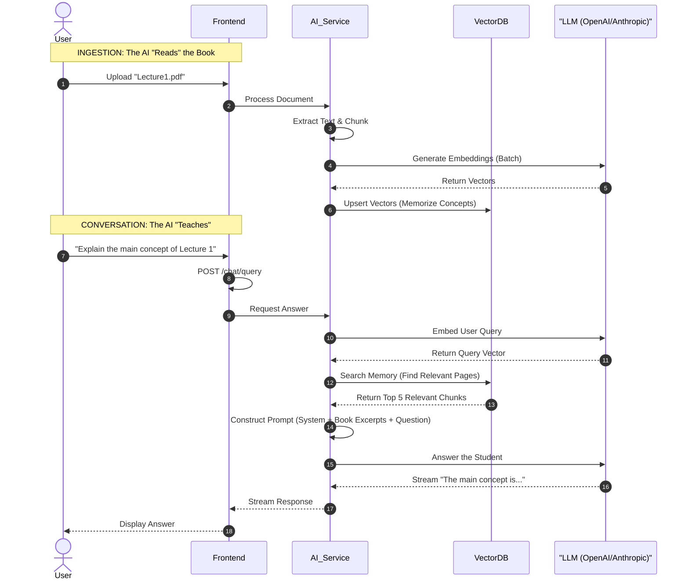

# The AI Engine: How It "Thinks"

This isn't just a wrapper around ChatGPT. We've built a sophisticated **Retrieval-Augmented Generation (RAG)** pipeline.

Why? Because standard AI models can hallucinate. Our system is grounded in **your** data. It studies the course material so it can answer questions accurately, citing specific pages and concepts.

---

## Phase 1: The "Learning" Phase (Ingestion)

Before the AI can teach, it must learn. When a new course document is added:

1.  **Read**: We extract text from PDFs, preserving structure.
2.  **Chunk**: We break the text into bite-sized "thoughts" (chunks).
3.  **Memorize**: We convert these chunks into mathematical vectors (embeddings) and store them in a **Vector Database**. This acts as the AI's long-term memory for that specific course.

## Phase 2: The "Teaching" Phase (Retrieval & Answering)

When a student asks, _"What is the core principle of Thermodynamics?"_:

1.  **Recall**: We don't just guess. We search our Vector Database for the most relevant "thoughts" (chunks) related to Thermodynamics from the uploaded textbooks.
2.  **Contextualize**: We hand those specific book excerpts to the LLM (Large Language Model) along with the student's question.
3.  **Answer**: The LLM acts as a synthesizer. It reads the excerpts and formulates a clear, concise answer based _only_ on the provided facts.

### The RAG Pipeline Visualized

---

## Anti-Hallucination Strategy

We explicitly instruct our AI:

> _"You are an expert academic tutor. You answer questions based **ONLY** on the provided context visuals. If the answer isn't in the book, admit you don't know rather than making it up."_

This builds trust. Students know the answer comes from their curriculum, not random internet data.
