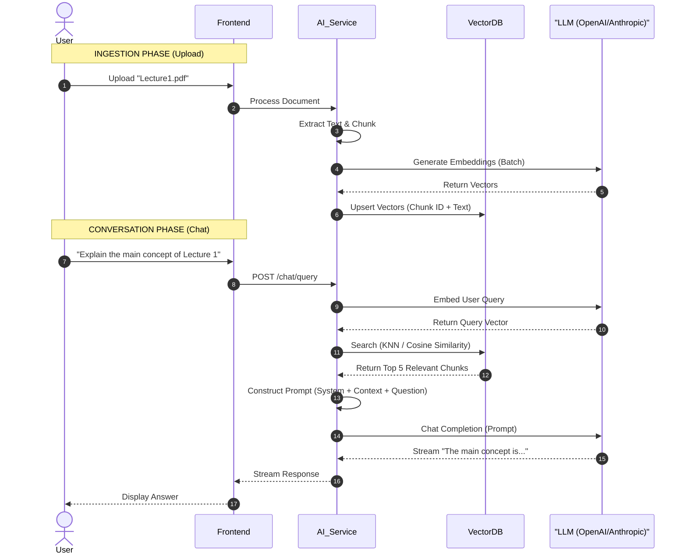

# AI Workflow & RAG Pipeline

## Retrieval-Augmented Generation (RAG) Architecture

This document details how the platform delivers accurate, context-aware AI responses using RAG.

### 1. Ingestion Pipeline (The "Learning" Phase)

When a student uploads a document (PDF, DOCX, TXT):

1.  **Text Extraction**: OCR/Text parsing to get raw string content.
2.  **Chunking**: Split text into semantic chunks (e.g., 500 tokens with 50 token overlap).
3.  **Embedding**: Pass chunks to an Embedding Model (e.g., OpenAI `text-embedding-3-small` or HuggingFace local models).
4.  **Indexing**: Store vectors + metadata (Page #, Source ID) in Vector Database.

### 2. Retrieval Pipeline (The "Answering" Phase)

When a student asks a question:

1.  **Query Embedding**: Convert user question into a vector.
2.  **Semantic Search**: Query Vector DB for "Nearest Neighbors" (most relevant chunks).
3.  **Context Assembly**: Combine User Question + Relevant Chunks into a systematic prompt.
4.  **LLM Generation**: Send prompt to LLM (GPT-4o / Claude 3.5 Sonnet).
5.  **Response**: Stream answer back to frontend.

---

### AI Pipeline Diagram

---

### Prompt Engineering Strategy

**System Prompt Template:**

> You are an expert academic tutor. You answer questions based ONLY on the provided context.
>
> **Context:**
> {{RETRIEVED_CHUNKS}}
>
> **Question:**
> {{USER_QUERY}}
>
> **Instructions:**
>
> 1. If the answer is found in the context, be concise and cite the source (e.g., "According to page 12...").
> 2. If the answer is NOT in the context, say "I cannot find this information in the provided materials."
> 3. Do not Hallucinate.
