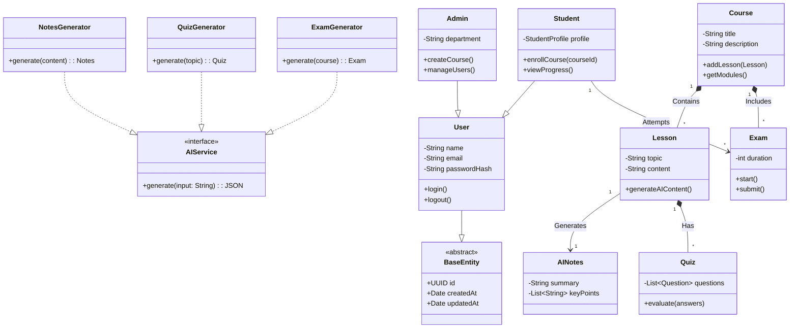

# Class Diagram

```mermaid
classDiagram
    %% Abstract & Interface Definitions
    class AIService {
        <<interface>>
        +generate(input: String): JSON
    }

    class BaseEntity {
        <<abstract>>
        +UUID id
        +Date createdAt
        +Date updatedAt
    }

    %% User Hierarchy (Inheritance)
    class User {
        -String name
        -String email
        -String passwordHash
        +login()
        +logout()
    }

    class Student {
        -StudentProfile profile
        +enrollCourse(courseId)
        +viewProgress()
    }

    class Admin {
        -String department
        +createCourse()
        +manageUsers()
    }

    User --|> BaseEntity
    Student --|> User
    Admin --|> User

    %% Core Domain Models
    class Course {
        -String title
        -String description
        +addLesson(Lesson)
        +getModules()
    }

    class Lesson {
        -String topic
        -String content
        +generateAIContent()
    }

    class AINotes {
        -String summary
        -List~String~ keyPoints
    }

    class Quiz {
        -List~Question~ questions
        +evaluate(answers)
    }

    class Exam {
        -int duration
        +start()
        +submit()
    }

    %% AI Implementation (Polymorphism)
    class NotesGenerator {
        +generate(content): Notes
    }

    class QuizGenerator {
        +generate(topic): Quiz
    }

    class ExamGenerator {
        +generate(course): Exam
    }

    NotesGenerator ..|> AIService
    QuizGenerator ..|> AIService
    ExamGenerator ..|> AIService

    %% Relationships
    Course "1" *-- "*" Lesson : Contains
    Lesson "1" --> "1" AINotes : Generates
    Lesson "1" *-- "*" Quiz : Has
    Course "1" *-- "*" Exam : Includes
    Student "1" --> "*" Exam : Attempts
```
