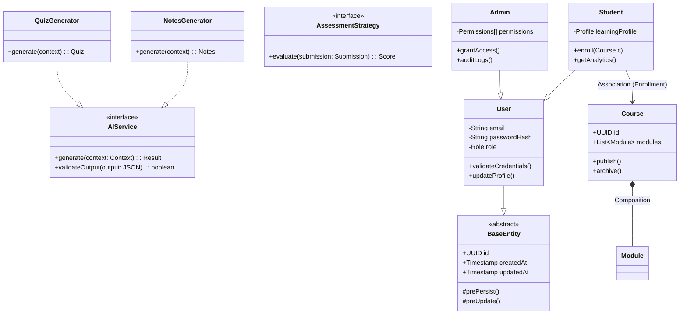

# Domain Class Model

This diagram represents the static structure of the domain entities and their relationships. It highlights the use of inheritance for user roles and interfaces for polymorphic AI service implementations.

## Design Patterns

- **Inheritance**: `Student` and `Admin` extend `User` to inherit identity properties (`email`, `passwordHash`).
- **Composition**: `Course` is composed of `Modules` and `Lessons`, enforcing a strict parent-child lifecycle.
- **Strategy Interface**: `AIService` defines the contract for various generative strategies (`NotesGenerator`, `QuizGenerator`).

## Diagram Source

