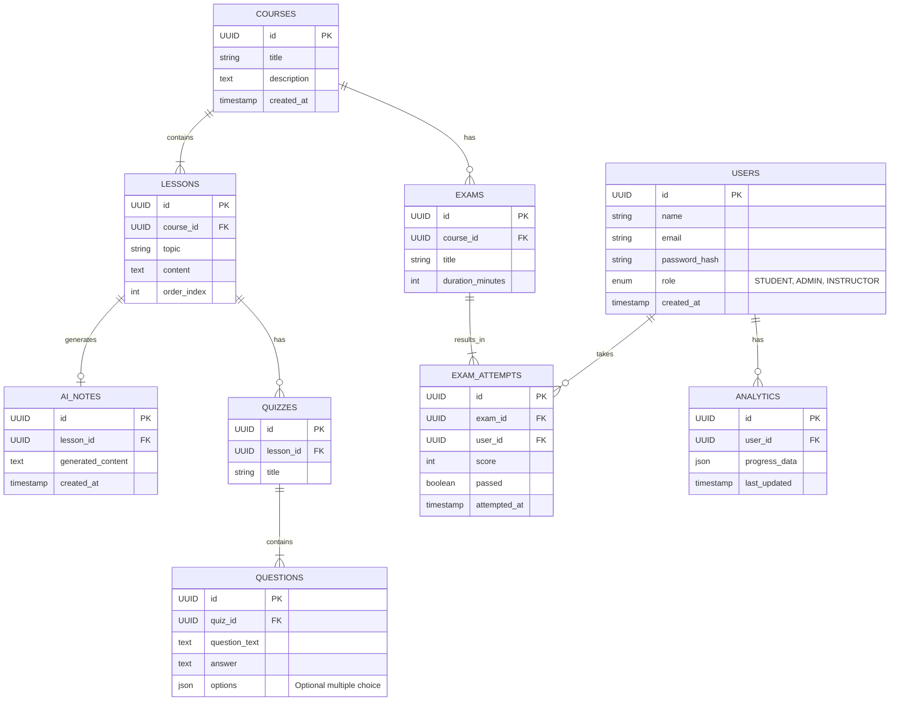

# The Filing System (ER Diagram)

This is how we organize the platform's long-term memory. It's not just a pile of data; it's a connected web of information.

### The Connections

- **Users & History**: We trace every `User` to their `ExamAttempts`. We verify not just _that_ they passed, but _when_ and with what score.
- **Content Tree**:
  - A **Course** is the root.
  - It branches into **Lessons**.
  - Lessons bloom into **Quizzes** and **AI Notes**.
- **Analytics**: This is the meta-layer. The `Analytics` table watches the user's interaction with everything else, building a profile of their progress.

### The Data Map

