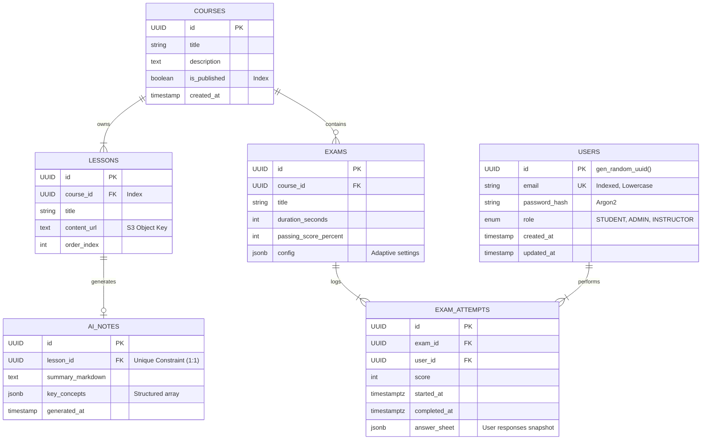

# Entity Relationship Diagram (ERD)

This diagram details the physical data model for the PostgreSQL database. It emphasizes 3rd Normal Form (3NF) compliance and the use of JSONB for semi-structured data attributes.

## Schema Highlights

- **Users**: Central identity table with role based discrimination.
- **Courses/Lessons**: Hierarchical content structure.
- **AI_Notes**: Stores generated content, strictly linked 1:1 with Lessons.
- **Exam_Attempts**: Immutable ledger of student assessment performance.

## Diagram Source

