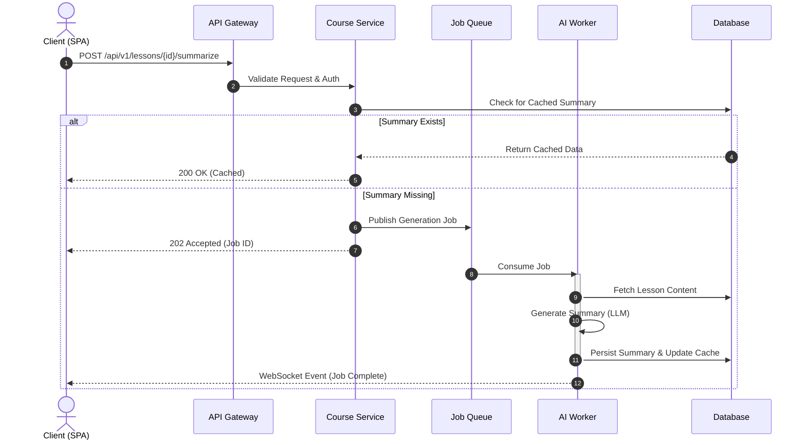

# Sequence Diagram: Content Generation Lifecycle

This diagram illustrates the synchronous and asynchronous message flow required to fulfill a content generation request (e.g., AI Summarization).

## Process Flow

1.  **Authentication**: The request is first intercepted by the API Gateway/Auth Service for JWT validation.
2.  **Job Queuing**: Valid requests are acknowledged immediately (HTTP 202 Accepted), and a task is published to the message broker.
3.  **Worker Execution**: The AI worker consumes the task, performs the LLM inference, and updates the database.
4.  **Completion Notification**: The client is notified via WebSocket or Polling that the resource is available.

## Diagram Source

