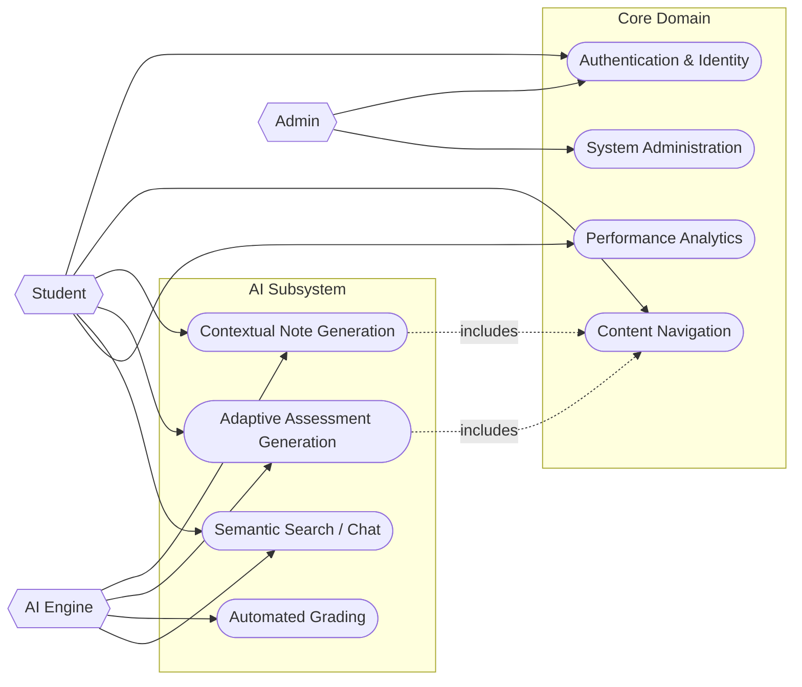

# Use Case Specifications

This diagram delineates the functional scope of the system, identifying primary actors and their permissible interactions with the platform's core domains.

## Actor Definitions

- **Student**: Authenticated end-user with read access to content and write access to assessment submissions.
- **Admin**: Privileged user responsible for content lifecycle management (CRUD on Courses/Lessons) and user administration.
- **AI Engine**: Autonomous system actor triggered by specific events (e.g., "Generate Notes") to perform background processing.

## Diagram Source

> **Note**: This diagram uses `flowchart` syntax for maximum compatibility, modeling Use Cases as rounded nodes and Actors as hexagons/circles.

