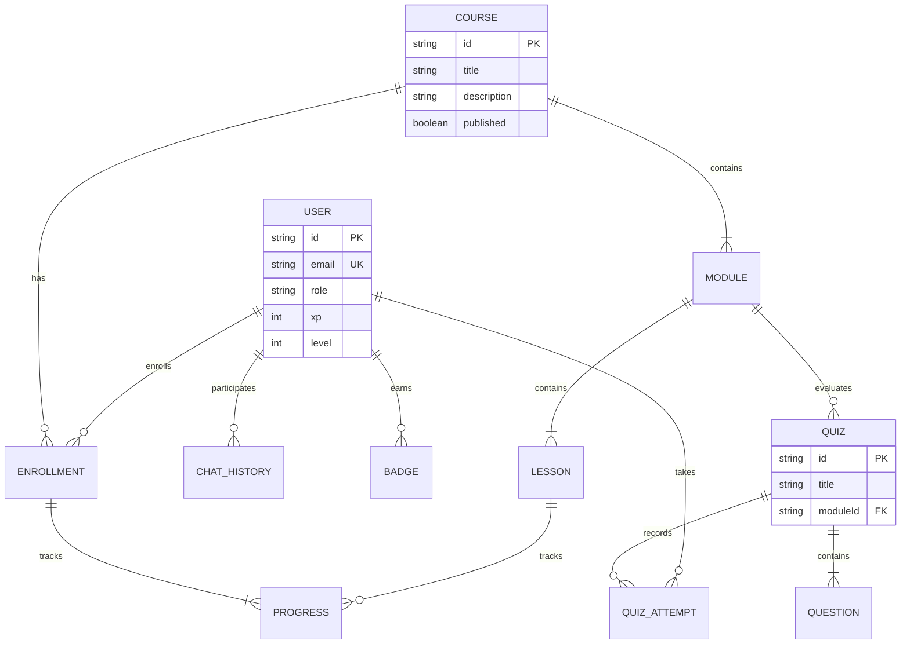

# Entity-Relationship (ER) Diagram

```mermaid
erDiagram
    USER ||--o{ ENROLLMENT : enrolls
    USER ||--o{ CHAT_HISTORY : participates
    USER ||--o{ QUIZ_ATTEMPT : takes
    USER ||--o{ BADGE : earns
    
    COURSE ||--|{ MODULE : contains
    COURSE ||--o{ ENROLLMENT : has
    
    MODULE ||--|{ LESSON : contains
    MODULE ||--o{ QUIZ : evaluates
    
    QUIZ ||--|{ QUESTION : contains
    QUIZ ||--o{ QUIZ_ATTEMPT : records
    
    LESSON ||--o{ PROGRESS : tracks
    ENROLLMENT ||--|{ PROGRESS : tracks

    USER {
        string id PK
        string email UK
        string role
        int xp
        int level
    }

    COURSE {
        string id PK
        string title
        string description
        boolean published
    }

    QUIZ {
        string id PK
        string title
        string moduleId FK
    }
```
