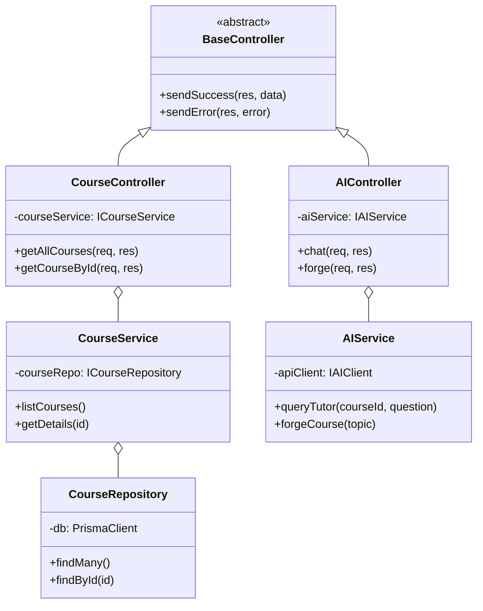

# Class Diagram (Backend Clean Architecture)

```mermaid
classDiagram
    class BaseController {
        <<abstract>>
        +sendSuccess(res, data)
        +sendError(res, error)
    }

    class CourseController {
        -courseService: ICourseService
        +getAllCourses(req, res)
        +getCourseById(req, res)
    }

    class AIController {
        -aiService: IAIService
        +chat(req, res)
        +forge(req, res)
    }

    class CourseService {
        -courseRepo: ICourseRepository
        +listCourses()
        +getDetails(id)
    }

    class AIService {
        -apiClient: IAIClient
        +queryTutor(courseId, question)
        +forgeCourse(topic)
    }

    class CourseRepository {
        -db: PrismaClient
        +findMany()
        +findById(id)
    }

    BaseController <|-- CourseController
    BaseController <|-- AIController
    
    CourseController o-- CourseService
    AIController o-- AIService
    
    CourseService o-- CourseRepository
```
