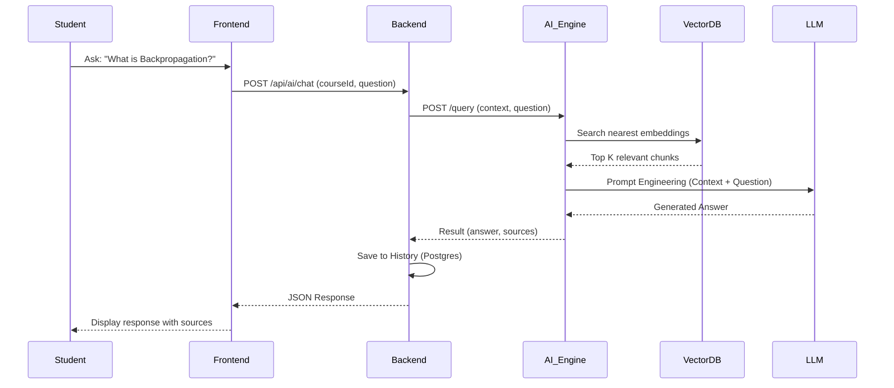

# Sequence Diagram (Main RAG Flow)

```mermaid
sequenceDiagram
    participant Student
    participant Frontend
    participant Backend
    participant AI_Engine
    participant VectorDB
    participant LLM

    Student->>Frontend: Ask: "What is Backpropagation?"
    Frontend->>Backend: POST /api/ai/chat (courseId, question)
    Backend->>AI_Engine: POST /query (context, question)
    AI_Engine->>VectorDB: Search nearest embeddings
    VectorDB-->>AI_Engine: Top K relevant chunks
    AI_Engine->>LLM: Prompt Engineering (Context + Question)
    LLM-->>AI_Engine: Generated Answer
    AI_Engine-->>Backend: Result (answer, sources)
    Backend->>Backend: Save to History (Postgres)
    Backend-->>Frontend: JSON Response
    Frontend-->>Student: Display response with sources
```
